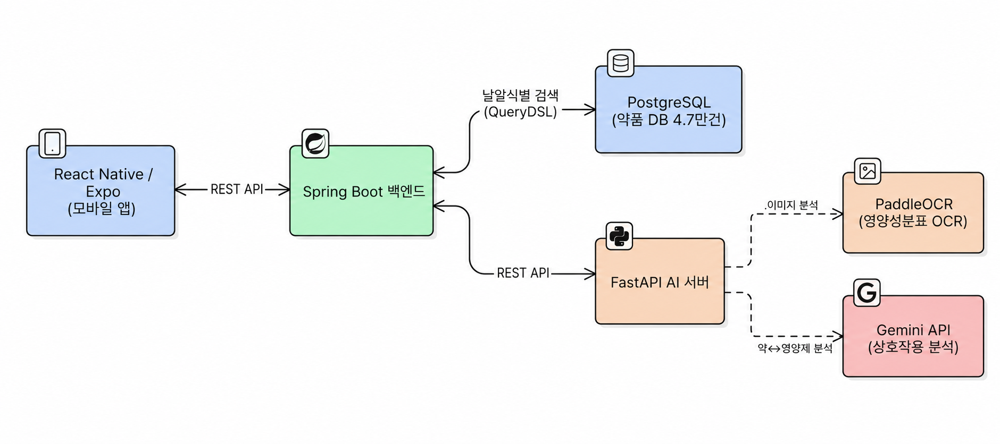
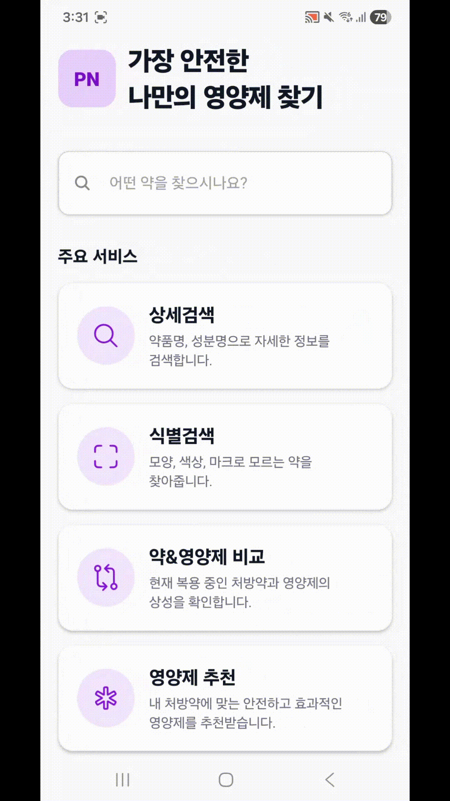
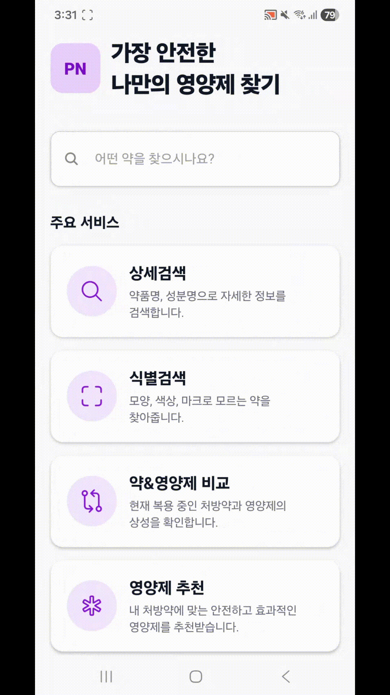
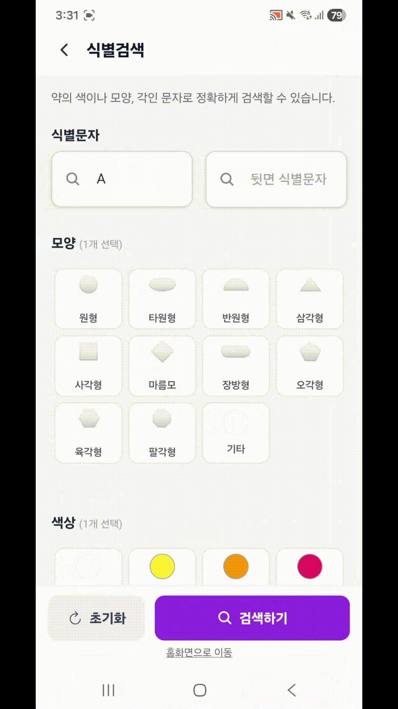
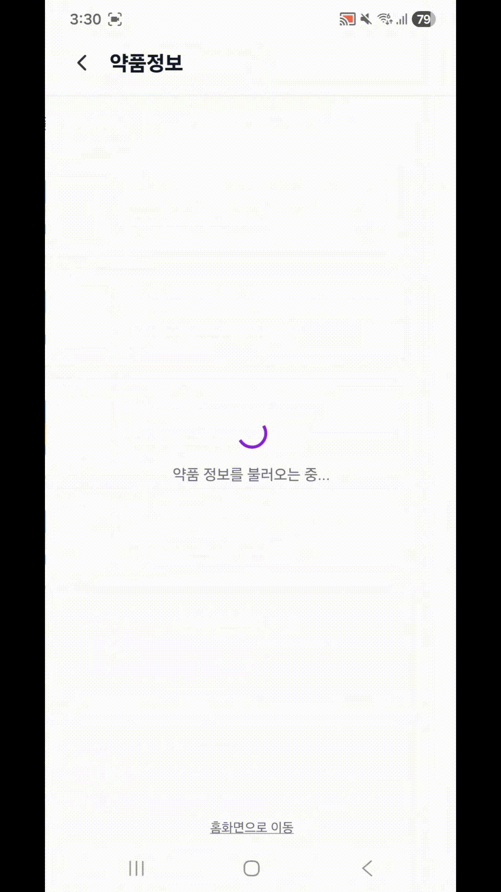
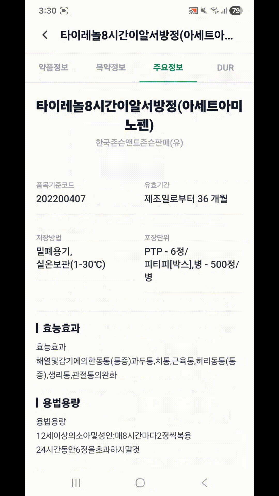
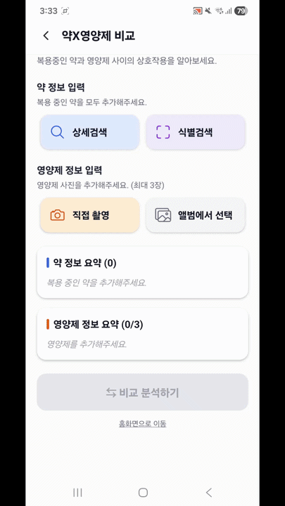
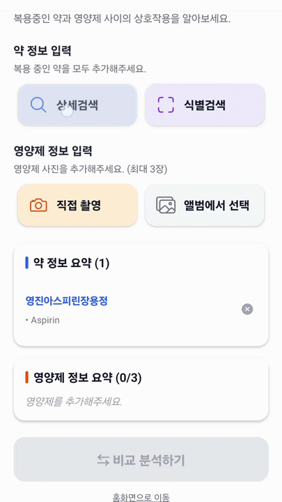
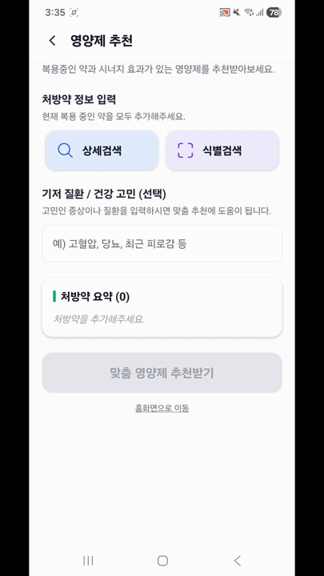

# PNN_Project: 처방약·영양제 상호작용 분석 앱

## **1. 프로젝트 개요 (Project Overview)**

- 기획 배경: 처방약을 복용하는 동안 평소 섭취하던 영양제와의 상호작용을 일반 사용자가 직접 판단하기 어렵습니다. 흡수 방해, 시너지, 시간 간격 조정 등 의약학적 판단이 필요한 정보가 흩어져 있고, 일반인이 접근 가능한 공개 데이터셋(병용금기 등)도 약↔약 기준이라 약↔영양제 조합에는 사용할 수 없습니다.
- 프로젝트 목표: 사용자가 복용 중인 처방약과 보유 영양제를 등록하면, AI가 두 조합의 상호작용을 분석해 위험도(WARNING/SAFE)와 행동 가이드를 제공합니다. 처방약은 약학정보원·심평원 CSV를 통합한 4.7만건 의약품 DB에서 낱알식별·약품명으로 검색하고, 영양제는 영양성분표를 촬영하면 OCR로 자동 등록됩니다.

 

## **2. 기술 스택 (Tech Stack)**

- Backend

| Category | Detail (Java) |
| --- | --- |
| **BackEnd** | **Java 17**, **Spring Boot 3.5.11** |
| **Library & API** | **Spring Data JPA**, **QueryDSL** (동적 검색), **Spring Security**, **RestClient** (Server-to-Server Comm), **PDFBox** (PDF 텍스트 추출), Lombok, dotenv-java |
| **IDE** | IntelliJ IDEA |
| **Server** | Apache Tomcat (Spring Boot Embedded) |
| **Document** | **Swagger** (SpringDoc OpenAPI 3.0) |
| **CI** | **Gradle** (Build Tool) |
| **DataBase** | **PostgreSQL** |

 
 

- AI-server

| Category | Detail (Python) |
| --- | --- |
| **BackEnd** | **Python, FastAPI** |
| **Library & API** | **Google GenAI** (Gemini), **PaddleOCR** (영양성분표 OCR), pydantic, psycopg, pgvector |
| **IDE** | **PyCharm** |
| **Server** | **Uvicorn** (FastAPI Server) |
| **Document** | **Swagger UI** (Built-in OpenAPI) |
| **CI** | **pip** |

 
 

- Frontend

| Category | Detail (TypeScript) |
| --- | --- |
| **FrontEnd** | **React Native / Expo** |
| **OS** | **Android** |
| **Library & API** | **React Navigation**, **Axios**, **Zustand**, **Expo Image Picker** |
| **IDE** | **VSCode** |
| **Server** | **Node.js** |
| **CI** | **npm** |

 
 

## **3. 시스템 아키텍처 (System Architecture)**

  

 

- 모바일 앱이 Spring Boot 백엔드에 REST API로 요청
- Spring Boot는 PostgreSQL의 의약품 DB(4.7만건)에서 QueryDSL BooleanBuilder로 동적 검색 처리
- 영양성분표 OCR과 약↔영양제 상호작용 분석은 FastAPI AI 서버에서 처리
  - PaddleOCR: 영양성분표 이미지 텍스트 추출
  - Gemini API: WARNING/SAFE 등급 판단

 
 

## **4. 주요 기능 (Key Features)**

### 약품 검색

#### 1. 상세 검색

- 약품명, 제조사명, 성분명 조건으로 약품 검색
- 성분명 검색 시 `drug_ingredients` 테이블과 JOIN하여 한글·영문 성분 양쪽 매칭
- QueryDSL BooleanBuilder로 입력된 조건만 동적 WHERE 절에 추가

 
 

#### 2. 낱알식별 검색

- 모양·색상·제형·분할선·각인 등 다중 필터 조합 검색
- 각인·색상은 앞면/뒷면 양쪽 컬럼을 OR로 묶어 검색 정확도 보완
- 입력되지 않은 조건은 동적으로 제외

 
 

#### 3. 약품정보 / 복약정보 조회

- 약품 상세 페이지에서 약학정보원 기반 약품정보 표시
- 복약정보 탭에서 효능·용법·부작용 등 환자용 안내 정보 조회

 
 

#### 4. 주요정보 / DUR 조회

- 허가정보(제조사·승인일 등) 표시
- DUR 데이터 기반 병용금기·연령금기·임부금기 등 안전 정보 표시

 
 

### 상호작용 분석 — A. 약 × 영양제 비교

#### A-1. 약품 조회

- 분석할 처방약을 약품 검색 또는 낱알식별로 선택
- 선택한 약품을 분석 대상 리스트에 추가

 
 

#### A-2. 영양성분 식별

- 영양제 영양성분표 이미지 촬영 후 서버 전송
- PaddleOCR로 텍스트 추출 → Gemini API로 성분명·함량 JSON 정형화
- 성분명은 영문으로 통일해 후속 LLM 분석과 일관성 확보

 
 

#### A-3. 상호작용 분석

- 처방약 성분(영문)과 영양제 성분(영문)을 Gemini API에 함께 전달
- WARNING / SAFE 2단계 등급으로 분류, 행동 가이드 함께 반환
- DB에 성분 데이터 없을 시 CAUTION 폴백 처리

 
 

### 상호작용 분석 — B. 영양제 추천

#### B-1. 약품 조회

- 장기 복용 중인 처방약을 검색·낱알식별로 등록

 
 

#### B-2. 기저 질환·상태 작성

- 사용자의 기저 질환·복용 목적·생활 습관 등 상태 정보 입력
- 추천 분석 시 LLM에 함께 전달되어 개인화된 결과 제공

 
 

#### B-3. 추천 영양성분 분석

- 처방약 성분과 사용자 상태를 기반으로 결핍 가능성 있는 영양성분 추천
- 처방약과 충돌하지 않는 안전 성분만 필터링

 
 

#### B-4. 추천 제품 구매 링크

- 추천 영양성분이 포함된 실제 제품 정보를 외부 구매 링크로 연결

 
 
